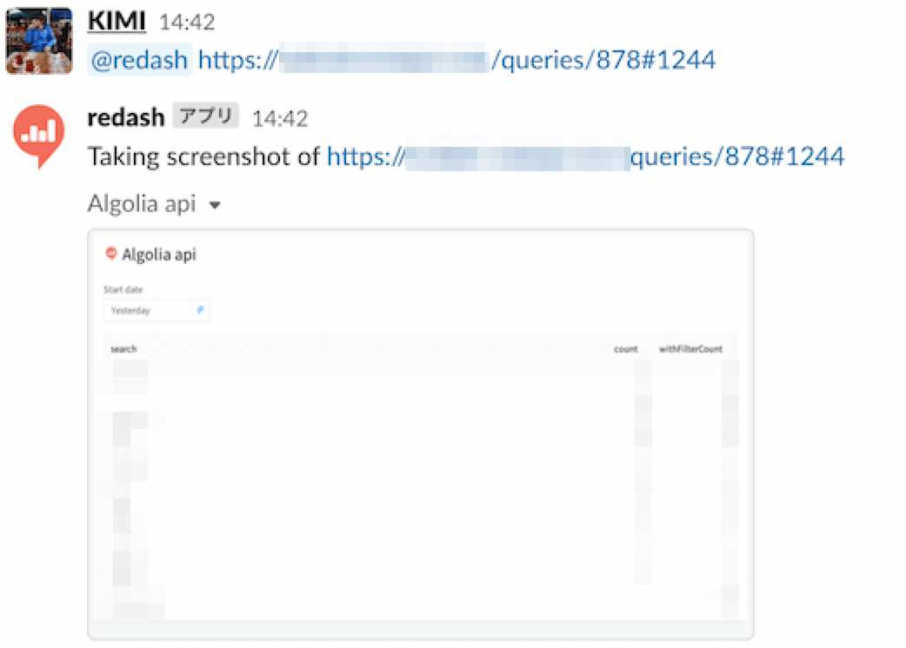

# Slack Bot for Redash on AWS Lambda

This is Slack bot for [Redash](https://redash.io/) built with [AWS SAM](https://docs.aws.amazon.com/serverless-application-model/).

## Features

* Running on AWS Lambda (so low-cost).
* Made with [Bolt](https://slack.dev/bolt-js/concepts) framework (Non-Socket Mode).
* Take a screenshot of query visualization or dashboard.



## Usage

Simply mention the configured bot in Slack with a Redash query or dashboard URL. The bot will take a screenshot of the corresponding visualization or dashboard and post it in the Slack channel.

You can also send a `ping` message with a mention to the bot, and it will respond with `pong 🏓`.

## Prerequisites

- AWS SAM CLI
- Docker w/ Compose
- Node.js
- ngrok

## Setup and Development

**Clone the Repository**

```
git clone https://github.com/rentio/redashbot-sam
cd redashbot-sam
```

**Set Up Local Environment with Docker**

Start Redash and create test data:
```
make setup
docker compose up
```

In another terminal:
```
open http://localhost:5001/users/me
# Login with admin@example.com/password and get User API Key
make REDASH_API_KEY=your-redash-api-key sample_query_and_dashboard
```

**Configure samconfig.yaml**

Copy and edit the sample configuration file:
```
cp samconfig.yaml.sample samconfig.yaml
```

Set the parameter_overrides in the default block:
```
default:
  # ...
  local_start_api:
    parameters:
      parameter_overrides:
        - Env=development
        - RedashHost=server:5000
        - RedashApiKey=(Redash API Key)
        - SlackBotToken=(Slack Bot User OAuth Token)
        - SlackSigningSecret=(Slack Signing Secret)
      # ...
```

**Expose Local Server with ngrok**

Used to forward Slack events to your local environment:
```
ngrok http 3000
```

Using a fixed domain is recommended:
```
ngrok http your-domain.ngrok-free.app 3000
```

**Configure Slack App**

- Create a Slack workspace
- Create a Slack app
  - Add the following scopes under OAuth & Permissions:
    - app_mentions:read
    - chat:write
    - files:read
    - files:write
  - Under Event Subscriptions:
    - Turn on Enable Events and set the Request URL to your ngrok URL
    - e.g., `https://your-domain.ngrok-free.app/slack/events`
    - Add the `app_mention` event under Subscribe to bot events

**Run Locally**

```
npm run dev
```

If you want to change the font of the output image, add font file to `. /layers/dependencies/nodejs/fonts`.

## Deployment

### Staging

**Edit the `staging` section in samconfig.yaml to set the required environment variables:**

```
staging:
  global:
    parameters:
      stack_name: "redashbot-sam-staging"
      region: "ap-northeast-1"
  deploy:
    parameters:
      capabilities:
        - CAPABILITY_IAM
      confirm_changeset: true
      resolve_s3: true
      parameter_overrides:
        - Env=staging
        - RedashHost=<Redash Host URL>
        - RedashApiKey=<Redash API Key>
        - SlackBotToken=<Slack Bot Token>
        - SlackSigningSecret=<Slack Signing Secret>
        - LambdaPublicSubnetId=<Public Subnet ID>
        - LambdaSecurityGroupId=<Security Group ID>
```

**Execute the deployment:**

```
npm run deploy:staging

# If you need to specify an AWS profile
npm run deploy:staging -- --profile <profile>
```

**After deployment:**

- Attach an Elastic IP to the Lambda's network interface
- Configure the API Gateway endpoint in your Slack app's Event Subscriptions

### Production

**Edit the `production` section in samconfig.yaml to set the required environment variables:**

```
production:
  global:
    parameters:
      stack_name: "redashbot-sam-production"
      region: "ap-northeast-1"
  deploy:
    parameters:
      capabilities:
        - CAPABILITY_IAM
      confirm_changeset: true
      resolve_s3: true
      parameter_overrides:
        - Env=production
        - RedashHost=<Redash Host URL>
        - RedashApiKey=<Redash API Key>
        - SlackBotToken=<Slack Bot Token>
        - SlackSigningSecret=<Slack Signing Secret>
        - LambdaPublicSubnetId=<Public Subnet ID>
        - LambdaSecurityGroupId=<Security Group ID>
```

**Execute the deployment:**

```
npm run deploy:production

# If you need to specify an AWS profile
npm run deploy:production -- --profile <profile>
```

**After deployment:**

- Attach an Elastic IP to the Lambda's network interface
- Configure the API Gateway endpoint in your Slack app's Event Subscriptions

**NOTE**:
Accessing Resources in a VPC
If Redash is located in a VPC, set LambdaPublicSubnetId and LambdaSecurityGroupId in your samconfig.yaml to allow the Slack bot to access those resources.

## Contributing

Bug reports and pull requests are welcome. Please report issues [here](https://github.com/rentio/redashbot-sam/issues).

## Resources

- [AWS SAM Developer Guide](https://docs.aws.amazon.com/serverless-application-model/)
- [Bolt for JavaScript Documentation](https://tools.slack.dev/bolt-js/)
- [Redash Documentation](https://redash.io/help/)
